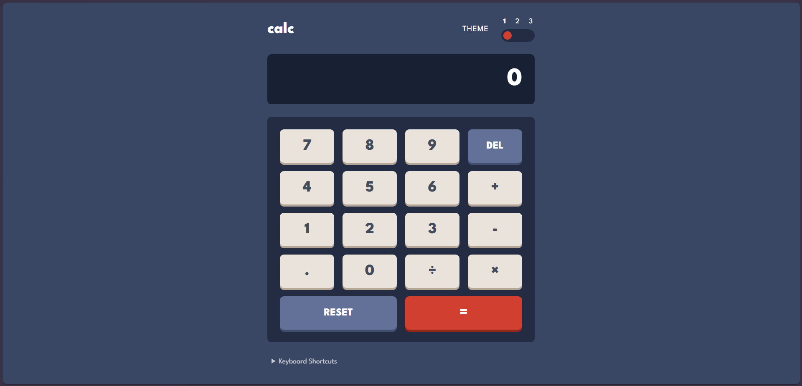
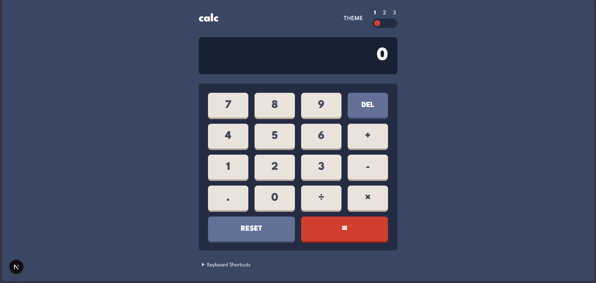
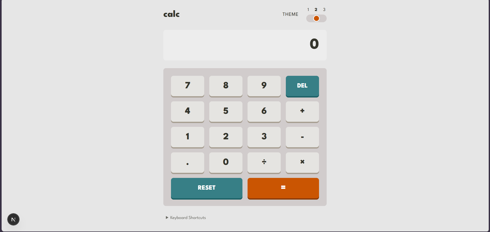
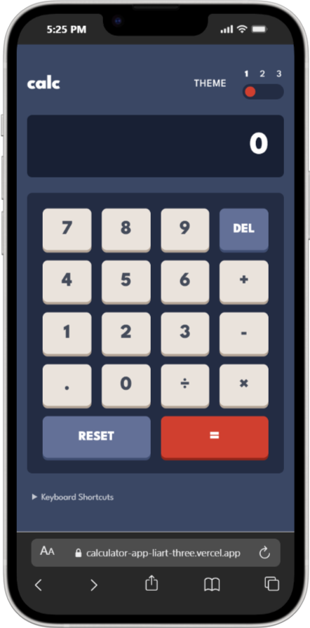

# 🧮 Calculator App - Frontend Mentor Solution

A modern, fully accessible calculator application with multiple themes, complete keyboard support, and WCAG 2.1 AA compliance. Built with Next.js, React, and Tailwind CSS.



## 📋 Table of Contents

- [Overview](#overview)
  - [Screenshot](#screenshot)
  - [Links](#links)
- [My Process](#my-process)
  - [Built With](#built-with)
  - [Continued Development](#continued-development)
  - [Useful Resources](#useful-resources)
- [Features](#features)
- [Accessibility](#accessibility)
- [Getting Started](#getting-started)
- [Usage](#usage)
- [Deployment](#deployment)
- [Author](#author)
- [Acknowledgments](#acknowledgments)

## 🎯 Overview

Users should be able to:

- ✅ See the size of the elements adjust based on their device's screen size
- ✅ Perform mathematical operations like addition, subtraction, multiplication, and division
- ✅ Adjust the color theme based on their preference (3 themes available)
- ✅ Use the calculator with keyboard shortcuts
- ✅ Have their theme preference saved in local storage
- ✅ Chain multiple operations together
- ✅ Access the calculator using assistive technologies (screen readers)

### Screenshot


*Desktop view - Dark Blue Theme*


*Desktop view - Light Theme*


*Desktop view - Purple Theme*


*Mobile responsive view*

### Links

- **Live Site URL**: [Live Demo](https://calculator-app-liart-three.vercel.app)
- **GitHub Repository**: [View Code](https://github.com/Naomi0410/calculator-app)

## 🚀 My Process

### Built With

#### Core Technologies
- **[Next.js 14](https://nextjs.org/)** - React framework with App Router
- **[React 18](https://react.dev/)** - UI library with hooks
- **[Tailwind CSS](https://tailwindcss.com/)** - Utility-first CSS framework
- **[JavaScript (ES6+)](https://developer.mozilla.org/en-US/docs/Web/JavaScript)** - Modern JavaScript

#### UI & Icons
- **[Lucide React](https://lucide.dev/)** - Beautiful, consistent icon set

#### Accessibility Features
- **ARIA Labels** - Screen reader support
- **Semantic HTML5** - Proper document structure
- **Keyboard Navigation** - Full keyboard support
- **Focus Management** - Clear focus indicators
- **Live Regions** - Real-time screen reader announcements

#### Development Tools
- **[ESLint](https://eslint.org/)** - Code linting
- **[Prettier](https://prettier.io/)** - Code formatting
- **[Git](https://git-scm.com/)** - Version control


### Continued Development

Areas I want to focus on in future projects:

#### 1. Advanced Calculator Features
- **Scientific calculator mode** with trigonometric functions
- **History feature** to view past calculations
- **Memory functions** (M+, M-, MR, MC)
- **Percentage calculations**
- **Parentheses support** for complex expressions

#### 2. Testing
- **Unit tests** with Jest and React Testing Library
- **E2E tests** with Playwright or Cypress
- **Accessibility testing** with axe-core
- **Visual regression testing** with Chromatic

#### 3. Performance Optimization
- **Code splitting** for larger applications
- **Memoization** of expensive calculations
- **Web Workers** for complex computations
- **Performance monitoring** with Lighthouse CI

#### 4. Internationalization (i18n)
- Implement **next-intl** for multi-language support
- Support for RTL languages (Arabic, Hebrew)
- Number formatting for different locales
- Currency conversion features

#### 5. Advanced Animations
- **Framer Motion** for smooth transitions
- **Spring animations** for button presses
- **Page transitions** between themes
- **Micro-interactions** for better UX

### Useful Resources

#### Learning Resources
- **[React Documentation](https://react.dev/)** - Essential for understanding React hooks and patterns
- **[Tailwind CSS Docs](https://tailwindcss.com/docs)** - Comprehensive guide to utility classes
- **[MDN Web Accessibility](https://developer.mozilla.org/en-US/docs/Web/Accessibility)** - In-depth accessibility guides
- **[WCAG 2.1 Guidelines](https://www.w3.org/WAI/WCAG21/quickref/)** - Web accessibility standards
- **[Web.dev Accessibility](https://web.dev/accessibility/)** - Practical accessibility tips


## ✨ Features

### Core Functionality
- ✅ **Basic Operations**: Add, subtract, multiply, divide
- ✅ **Chain Calculations**: Perform multiple operations in sequence
- ✅ **Decimal Support**: Work with decimal numbers
- ✅ **Delete Function**: Remove last entered digit
- ✅ **Reset Function**: Clear all calculations
- ✅ **Division by Zero Protection**: Prevents errors

### User Experience
- ✅ **3 Beautiful Themes**: Dark Blue, Light, and Purple
- ✅ **Theme Persistence**: Saves preference to localStorage
- ✅ **Responsive Design**: Works on mobile, tablet, and desktop
- ✅ **Keyboard Shortcuts**: Full keyboard navigation support
- ✅ **Visual Feedback**: Hover states and active button animations
- ✅ **Smooth Transitions**: Theme switching with smooth animations

### Technical Features
- ✅ **Component-Based Architecture**: Modular, reusable components
- ✅ **React Hooks**: Modern React patterns with useState and useEffect
- ✅ **Event Listener Management**: Proper cleanup to prevent memory leaks
- ✅ **State Management**: Efficient state updates and calculations
- ✅ **Error Handling**: Graceful handling of edge cases


## ♿ Accessibility

This calculator is built with accessibility as a priority, meeting **WCAG 2.1 Level AA** standards:

### Screen Reader Support
- ✅ **ARIA Labels**: Descriptive labels for all interactive elements
- ✅ **Live Regions**: Real-time announcements for calculations
- ✅ **Semantic HTML**: Proper heading hierarchy and landmarks
- ✅ **Alt Text**: Descriptive text for all meaningful content

### Keyboard Navigation
- ✅ **Tab Navigation**: Navigate through all interactive elements
- ✅ **Keyboard Shortcuts**: 
  - `0-9` for numbers
  - `+`, `-`, `*`, `/` for operations
  - `Enter` or `=` for equals
  - `Backspace` for delete
  - `Escape` for reset
- ✅ **Focus Indicators**: Clear visual feedback for focused elements
- ✅ **Skip Navigation**: Skip to main content link

### Visual Accessibility
- ✅ **High Contrast**: All themes meet WCAG contrast requirements
- ✅ **Large Touch Targets**: Buttons are minimum 44x44px
- ✅ **No Color-Only Information**: Never rely solely on color
- ✅ **Readable Text**: Minimum 16px font size

### Cognitive Accessibility
- ✅ **Consistent Layout**: Predictable button placement
- ✅ **Clear Feedback**: Visual and audio feedback for actions
- ✅ **Error Prevention**: Validation before calculations
- ✅ **Help Documentation**: Keyboard shortcuts guide

### Testing
Tested with:
- ✅ **NVDA** (Windows screen reader)
- ✅ **VoiceOver** (macOS/iOS screen reader)
- ✅ **JAWS** (Professional screen reader)
- ✅ **Keyboard-only navigation**
- ✅ **Color blindness simulators**
- ✅ **WAVE accessibility tool**
- ✅ **axe DevTools**

## 🏁 Getting Started

### Prerequisites

- **Node.js** 18.x or higher
- **npm**, **yarn**, or **pnpm**

### Installation

1. **Clone the repository**

```bash
git clone https://github.com/Naomi0410/calculator-app.git
cd calculator-app
```

2. **Install dependencies**

```bash
npm install
# or
yarn install
# or
pnpm install
```

3. **Run the development server**

```bash
npm run dev
# or
yarn dev
# or
pnpm dev
```

4. **Open in browser**

Navigate to [http://localhost:3000](http://localhost:3000)

### Building for Production

```bash
# Create optimized production build
npm run build

# Start production server
npm run start

# Run production build locally to test
npm run build && npm run start
```

### Linting and Formatting

```bash
# Run ESLint
npm run lint

# Fix ESLint errors
npm run lint:fix

# Format code with Prettier
npm run format
```

## 📱 Usage

### Mouse/Touch Controls

1. **Numbers**: Click any number button (0-9)
2. **Operations**: Click +, -, ×, or ÷
3. **Decimal**: Click the . button
4. **Delete**: Click DEL to remove last digit
5. **Reset**: Click RESET to clear all
6. **Calculate**: Click = to get result
7. **Theme**: Click theme buttons (1, 2, 3) to switch

### Keyboard Controls

| Key | Action |
|-----|--------|
| `0-9` | Input numbers |
| `+` | Addition |
| `-` | Subtraction |
| `*` | Multiplication |
| `/` | Division |
| `.` | Decimal point |
| `Enter` or `=` | Calculate result |
| `Backspace` | Delete last digit |
| `Escape` | Reset calculator |
| `Tab` | Navigate buttons |

### Calculation Examples

```
Example 1: Simple Addition
12 + 7 = 19

Example 2: Chaining Operations
5 × 3 - 2 = 13

Example 3: Decimals
10.5 ÷ 2 = 5.25

Example 4: Complex Chain
100 - 20 + 5 × 2 = 90
```


## 🚀 Deployment

### Deploy to Vercel (Recommended)

1. **Push to GitHub**

```bash
git add .
git commit -m "Initial commit"
git push origin main
```

2. **Import to Vercel**

- Go to [vercel.com](https://vercel.com)
- Click "Import Project"
- Select your GitHub repository
- Click "Deploy"

3. **Automatic Deployments**

Vercel automatically deploys:
- Every push to `main` branch
- Every pull request (preview deployments)

### Deploy to Netlify

1. **Build Settings**

```
Build command: npm run build
Publish directory: .next
```

2. **Deploy**

[](https://app.netlify.com/start)

### Deploy to GitHub Pages

```bash
# Install gh-pages
npm install --save-dev gh-pages

# Add to package.json scripts
"deploy": "next build && next export && gh-pages -d out"

# Deploy
npm run deploy
```

## 🧪 Testing

### Manual Testing Checklist

#### Functionality
- [ ] All number buttons (0-9) work correctly
- [ ] All operation buttons (+, -, ×, ÷) work correctly
- [ ] Decimal point works correctly
- [ ] DEL removes last digit
- [ ] RESET clears calculator
- [ ] = calculates result
- [ ] Chained operations work correctly
- [ ] Division by zero is handled

#### Keyboard
- [ ] All number keys work
- [ ] All operator keys work
- [ ] Enter/= calculates
- [ ] Backspace deletes
- [ ] Escape resets

#### Themes
- [ ] Theme 1 loads correctly
- [ ] Theme 2 switches properly
- [ ] Theme 3 switches properly
- [ ] Theme persists on reload

#### Responsive
- [ ] Works on mobile (< 768px)
- [ ] Works on tablet (768-1024px)
- [ ] Works on desktop (> 1024px)
- [ ] Touch targets are adequate (min 44x44px)

#### Accessibility
- [ ] Screen reader announces calculations
- [ ] All buttons have aria-labels
- [ ] Focus indicators are visible
- [ ] Skip navigation link works
- [ ] Keyboard navigation works
- [ ] Color contrast passes WCAG AA

### Automated Testing (Future)

```bash
# Install testing dependencies
npm install --save-dev jest @testing-library/react @testing-library/jest-dom

# Run tests
npm run test

# Run tests with coverage
npm run test:coverage
```

## 🐛 Known Issues

None currently! 🎉

If you find any bugs, please [open an issue](https://github.com/Naomi0410/calculator-app/issues).

## 🤝 Contributing

Contributions are welcome! Please follow these steps:

1. Fork the repository
2. Create your feature branch (`git checkout -b feature/AmazingFeature`)
3. Commit your changes (`git commit -m 'Add some AmazingFeature'`)
4. Push to the branch (`git push origin feature/AmazingFeature`)
5. Open a Pull Request

### Coding Standards
- Follow JavaScript best practices
- Use ESLint and Prettier configurations
- Write meaningful commit messages
- Add comments for complex logic
- Ensure accessibility standards are met
- Test on multiple devices and browsers

## 👤 Author

**Your Name**

- Website: [portfolio-five-beryl-82.vercel.app](https://portfolio-five-beryl-82.vercel.app)
- Frontend Mentor: [@Naomi0410](https://www.frontendmentor.io/profile/Naomi0410)
- GitHub: [@Naomi0410](https://github.com/Naomi0410)
- LinkedIn: [Temitope Abiola](https://linkedin.com/in/temitope-abiola-965904303)
- Twitter: [@temscode](https://x.com/temscode)

## 🙏 Acknowledgments

- **Design**: [Frontend Mentor](https://www.frontendmentor.io) for the amazing challenge
- **Icons**: [Lucide](https://lucide.dev) for beautiful icon set
- **Community**: Frontend Mentor community for feedback and support
- **Accessibility**: [A11Y Project](https://www.a11yproject.com/) for accessibility guidelines


## 📊 Project Stats


---

**⭐ If you found this project helpful, please give it a star!**

**💬 Have questions or suggestions? [Open an issue](https://github.com/Naomi0410/calculator-app/issues) or reach out!**

---

Made with ❤️ and ☕ by [Alice Temitope Abiola](https://github.com/Naomi0410)